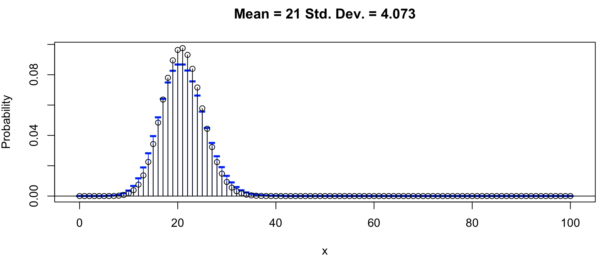
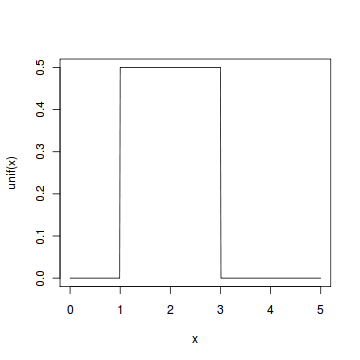
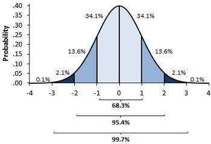

# Wstęp

Wiele zjawisk biologicznych czy ekonomicznych można wymodelować probabilistycznie. Polega to na odpowiednim wyborze modelu (np. rozkładu teoretycznego). Modelowanie tych zjawisk oraz rozkłady teoretyczne opierają się na rachunku prawdopodobieństwa.


# Podstawowe pojęcia w rachunku prawdopodobieństwa

### Zad. 1

Gdy rzucasz kostką do gry, **zmienna losowa** to liczba wyrzuconych oczek. 

**Zdarzenie losowe** polega na otrzymaniu jednej spośród sześciu możliwych wartości tej zmiennej. 

Pojedynczy wynik doświadczenia (np. wypadnięcie szóstki) nazywamy **zdarzeniem elementarnym**. 

Zbiór wszystkich możliwych wyników doświadczenia losowego nazywamy **przestrzenią zdarzeń elementarnych** i oznaczamy dużą grecką literą omega Ω 

```
Ω = {1, 2, 3, 4, 5, 6}
```

### Zad. 2
Zdarzenia elementarne przyjęło się oznaczać wielkimi literami z początku alfabetu (A,B,C). Na przykład zdarzenie elementarne polegające na wyrzuceniu pięciu lub sześciu oczek w rzucie kostką zapiszemy: 

```
A = {5, 6}
```

Zatem prawdopodobieństwo trafienia piątki lub szóstki zapiszemy jako: 

```
P(A) = |A| / |Ω| = 2 / 6 = 0.33
```

Zdarzenia, których prawdopodobieństwo otrzymania wynosi 1 nazywają się zdarzeniami pewnymi. Z kolei, zdarzenia, których prawdopodobieństwo wynosi 0 nazywają się zdarzeniami niemożliwymi.

# Dyskretne rozkłady prawdopodobieństwa
W dyskretnych rozkładach prawdopodobieństwa zmienna losowa przyjmuje skończony zbiór wartości w przedziale liczbowym (np. liczba oczek na kostce, liczba dzieci, liczba pomyłek). Jest to zmienia skokowa, która najczęściej zmienia się o jeden.

## Rozkład dwumianowy
Używamy tego rozkładu, kiedy w wyniku możemy otrzymać dwie wartości (np. sukces-porażka, zdrowy-chory, orzeł-reszka, puryna-pirymidyna).

### Zad. 3
Ile wynosi prawdopodobieństwo wypadnięcia orła dokładnie dwa razy?
> O: orzeł, R: reszka

Ω = {OOO, **OO**R, ORO R**OO**, RRO, ROR, ORR, RRR}

```
P(X = 2) = 3/8
```

### Zad. 4
Samodzielnie

### Zad. 5
Podczas trzech rzutów monetą prawdopodobieństwo:
- wypadnięcia orła 0 razy: P(X = 0) = 1/8 
- wypadnięcia orła 1 raz: P(X = 1) = 3/8
- wypadnięcia orła 2 razy: P(X = 2) = 3/8
- wypadnięcia orła 3 razy: P(X = 3) = 1/8

Prawdopodobieństwa zdarzeń elementarnych muszą się sumować do 1.

```R
x = c(0, 1, 2, 3)
y = c(1/8, 3/8, 3/8, 1/8)
plot(x, y)
plot(x, y, type="h")
barplot(y, names.arg = x)
```

### Zad. 6
Prawdopodobieństwo, że orzeł wypadnie przynajmniej jeden raz:

```
P(X >= 1) = 3/8 + 3/8 + 1/8 = 7/8
```

### Zad. 7
Wartość oczekiwana liczby wypadnięć orła to:

```
E(X) = 0 * 1/8 + 1 * 3/8 + 2 * 3/8 + 4 * 1/8
```

W R:

```R
sum(x*y)
```

Szybsze rozwiązanie: liczba rzutów *n* razy prawdopodobieństwo wypadnięcia orła.

```
E(X) = n * p = 3 * 0.5
```


### Zad. 8
Rzucam 5 razy kostką do gry i chciałbym wiedzieć jakie jest prawdopodobieństwo, że szóstka wypadnie dokładnie dwa razy. Zamiast wypisywać wszystkie kombinacje zdarzeń elementarnych (Ω = {11111, 11112, ..}), korzystamy z rozkładu dwumianowego.

Rozkład ten opisuje prawdopodobieństwo zajścia *k* sukcesów w ciągu *n* niezależnych prób (zdarzeń losowych), z których każda próba ma stałe prawdopodobieństwo sukcesu równe *p*. Innymi słowy, o tym rozkładzie mówimy wtedy, kiedy mamy *n* niezależnych doświadczeń losowych (np. 3 rzuty monetą), w których prawdopodobieństwo sukcesu (zajścia określonego zdarzenia np. wypadnięcia orła) w każdym doświadczeniu jest stałe i niezależne od wyników poprzednich i równe *p* (np. wynosi 0.5).

Funkcję prawdopodobieństwa otrzymania dokładnie *k* sukcesów na *n* prób określa wzór Bernouliego.


Obliczmy prawdopodobieństwo wypadnięcia 2 orłów w trzech rzutach monetą.


W programie R jest funkcja `dbinom`, która oblicza prawdopodobieństwo jeżeli podamy *k*, *n* i *p*.

```R
> dbinom(2, 3, 0.5)            # Funkcja prawdopodobieństwa
[1] 0.375                      # Prawdop. wypadnięcia orła dokładnie 2 razy.
```

Jakie jest prawdopodobieństwo, że orzeł wypadnie przynajmniej raz?

```R
> dbinom(1:3, 3, 0.5)
[1] 0.375 0.375 0.125          # Prawdop. wypadnięcia orła 1, 2 i 3 razy  
> sum(dbinom(1:3, 3, 0.5))     # Suma wartości tych prawdopodobieństw
[1] 0.875
```

Ile zatem wynosi prawdopodobieństwo, że w 5 rzutach kostkach, szóstka wypadnie dokładnie dwa razy?


### Zad. 9
samodzielnie

### Zad. 10
samodzielnie

### Zad. 11
samodzielnie

### Zad. 12
Koszykarz oddaje 4 rzuty do kosza. Piłka wpada do kosza z prawdopodobieństwem 0.8. Oblicz: 

1. wartość prawdopodobieństwa celnych rzutów do kosza (0, 1, 2, 3, 4)

   ```R
   dbinom(0:4, 4, 0.8)
   ```
2. wartość oczekiwaną celnych rzutów do kosza

   ```R
   4 * 0.8       # E(X) = n * p
   ```

   lub:

   ```R
   x = 0:4
   y = dbinom(x, 4, 0.8)
   sum(x * y)
   ```

3. wartość prawdopodobieństwa, że koszykarz trafi celnie co najwyżej 3 razy.

   ```R
   sum(dbinom(0:3, 4, 0.8))
   ```
   
   lub

   ```R
   pbinom(3, 4, 0.8)   # Dystrybuanta. Odpowiada ona na pytanie ile wynosi 
                       # prawdop. znalezienia wartości mniejszej bądź równej
                       # od danej wartości X 

   ```

### Zad. 13
samodzielnie

### Zad. 14
samodzielnie

### Zad. 15
samodzielnie

### Zad. 16
Wyświetl rozkład dwumianowy w R.

```R
library("TeachingDemos")              # Załaduj pakiet
install.packages("TeachingDemos")     # Zainstaluj pakiet (jeżeli niezainstalowany)
vis.binom()
```

Gdy *p* jest większe niż 0.5 to rozkład jest lewoskośny (długi lewy ogon), gdy mniejsze to prawoskośny (długi prawy ogon).

## Rozkład Poissona
Drugim popularnym typem dyskretnego rozkładu prawdopodobieństwa jest rozkład Poissona. Rozkład ten jest często nazywany rozkładem zdarzeń rzadkich. Tak więc przykłady zmiennych o rozkładzie Poissona to: liczba wypadków na osobę, liczba wygranych w totolotku, liczba awarii występujących w procesie produkcyjnym, liczba zwierząt na pewnym terenie. Te liczby są zgodne z rozkładem Poissona. 

Rozkładu Poissona używamy, kiedy nie jesteśmy w stanie określić, ile maksymalnie zajść zdarzenia może wystąpić w pewnym czasie *t*. W przeciwieństwie do rozkładu dwumianowego, gdzie zlicza się liczbę sukcesów i porażek, w rozkładzie Poissona liczy się jedynie zajście zdarzenia.

Funkcja prawdopodobieństwa ma postać:


Parametr λ jest wartością oczekiwaną (średnią) w tym rozkładzie, natomiast *k* oznacza liczbę zajść pewnego zdarzenia.


### Zad. 17
Dane z zadania:

* λ = 2
* *k* = 3

Obliczenie prawdopodobieństwa wprowadzenia 3 błędnych nukleotydów podczas replikacji DNA człowieka.


W R:

```R
> dpois(3, 2)
[1] 0.180447
```

### Zad. 18
Dane z zadania:
* λ = 10000
* k = 10100

```R
sum(dpois(0:10100, 10000))   
```

lub 

```R
ppois(10100, 10000)
```


### Zad. 19
Dane z zadania:

```
p = 1/10000         # prawdopodobieństwo pomyłki
n = 2000            # maksymalną liczbę prób
k = 0
```


Mamy zatem wszystkie dane aby rozwiązać zadanie używając rozkładu dwumianowego.

```R
> dbinom(k, n, p)
[1] 0.818722          # dokładne prawdopodobieństwo
```

Rozkład Poissona ma zastosowanie do obliczenia przybliżonej wartości prawdopodobieństwa w rozkładzie dwumianowym przy dużej liczbie prób i niskim prawdopodobieństwie sukcesu, tj. wtedy, gdy iloczy λ = *np* staje się wielkością stała. Jeżeli jest duża liczba prób (czyli *n* >= 100) i prawdopodobieństwo sukcesu jest niskie (*p* <= 0.2) to rozkład Poissona ma zastosowanie do obliczenia przybliżonej wartości prawdopodobieństwa w rozkładzie dwumianowym.


```R
> lambda = n*p
> dpois(0, lambda)
[1] 0.8187308         # przybliżona wartość prawdopodobieństwa
```

Zależność między rozkładem dwumianowym a Poissona można zobaczyć korzystając z biblioteki TeachingDemos i funkcji vis.binom(). Wyraźne podobieństwo w dwóch rozkładach widoczne jest gdy *n* >= 100 i *p* <= 0.2.




### Zad. 20
samodzielnie

# Ciągłe rozkłady prawdopodobieństwa
W odróżnieniu od dyskretnych rozkładów prawdopodobieństwa, w których zmienna losowa przyjmuje skończony zbiór wartości w przedziale liczbowym, w rozkładach ciągłych zmienna losowa może przyjmować wartości ciągłe (czyli dowolne wartości zmiennoprzecinkowe). 

W ciągłym rozkładzie prawdopodobieństwa nie zadajemy już pytania, o prawdopodobieństwo otrzymania jednej konkretnej wartości zmiennej losowej (bo wynosi ono zero). Możemy jedynie pytać jakie jest prawdopodobieństwo, że zmienna ciągła przyjmuje wartości w pewnym przedziale liczbowym (mówimy wtedy o gęstości prawdopodobieństwa).

## Rozkład jednostajny
Inaczej rozkład prostokątny. Jest to rozkład prawdopodobieństwa, dla którego gęstość prawdopodobieństwa w przedziale od *a* do *b* jest stała i różna od zera, a poza nim równa zeru.

Na przykład, rozkład jednostajny, w którym *a* = 1 i *b* = 3.


Prawdopodobieństwo uzyskania konkretnej wartości między 1 i 3 wynosi 0. Pole pod krzywą to prawdopodobieństwo całkowite wynoszące 1.


### Zad. 21

1. Prawdopodobieństwo czekania mniej niż 12.5 minuty wynosi:

```R 
punif(12.5, 0, 15)
```

2. Poniżej jakiej wartości czasu czekamy 90% razy. Jest to pytanie o kwantyl rzędu 90% (percentyl 9) z zadanego rozkładu.

```R
qunif(0.9, 0, 15)
```

## Rozkład normalny
Rozkład normalny zwany jest także rozkładem Gaussa. Rozkład ten ma charakterystyczny kształt "krzywej dzwonowej" i jest symetryczny względem średniej (średnia jest na środku). 

Jest to teoretyczny rozkład prawdopodobieństwa powszechnie wykorzystywany do modelowania wielu zjawisk przyrodniczych, ekonomicznych itd. Zmienne losowe, które podlegają rozkładowi normalnemu zależą od wielu czynników (a formalnie od nieskończonej liczby innych niezależnych zmiennych losowych). Przykładowo, istnieje prawie nieograniczona liczba czynników warunkujących wzrost człowieka (np. sposób odżywiania, predyspozycje genetyczne, przebyte choroby, poziom hormonu wzrostu itd.). Tak więc należy się̨ spodziewać, że w populacji wzrost podlega rozkładowi normalnemu - najwięcej mamy ludzi średniego wzrostu, mało ludzi bardzo niskich i mało ludzi bardzo wysokich.

Kształt rozkładu zależy od dwóch parametrów: średniej i odchylenia standardowego.

```R
library("TeachingDemos")
vis.normal()
```

Średnia jest zaznaczona niebieską kreską pionową, a odchylenie standardowe poziomą. Średnia i odchylenie standardowe w populacji oznaczane są małymi greckimi literami: μ (mi) i σ (sigma). Średnia przesuwa krzywą wzdłuż osi odciętych, natomiast parametr odchylenia standardowego powoduje, że krzywa jest bardziej spłaszczona lub wysmukła (im większy, tym bardziej spłaszczony). Mimo zmiany parametrów rozkład jest cały czas symetryczny (średnia = medianie = dominancie). 

 

W odległości 1 odchylenia standardowego od średniej znajduje się 34.14% wszystkich obserwacji po jednej stronie (po dwóch 68.28%). 95.45% wszystkich obserwacji nie różni się od średniej arytmetycznej o więcej niż 2 odchylenia standardowe. Jeżeli średnia = 0, a odchylenie standardowe = 1 to rozkład normalny nazywa się standardowym rozkładem normalnym i oznaczany jest jako N(0, 1).


### Zad. 22
samodzielnie


### Zad. 23
Prawdopodobieństwo otrzymania wartości mniejszej niż 1 w rozkładzie normalnym (μ = 0, σ = 1) wynosi:

```R
pnorm(1, mean=0, sd=1)
```

### Zad. 24
Poniżej jakiej wartości zmiennej X znajduje się 90% obserwacji.

```R
> qnorm(0.9, mean=0, sd=1)
```

### Zad. 25
Skorzystaj z `vis.norm()` i ustaw rozkład dla μ = 1.9 i σ = 0.5.

1. Widać gołym okiem. Dla formalności:

   ```R
   pnorm(1.9, 1.9, 0.5)
   ```

2. Mniejszej lub równej 2.2.

   ```R
   pnorm(2.2, 1.9, 0.5)
   ```

3. Większej od 2.2.

   ```R
   1 - pnorm(2.2, 1.9, 0.5)
   ```

4. Na poziomie 1.4-2.4.

   ```R
   pnorm(2.4, 1.9, 0.5) - pnorm(1.4, 1.9, 0.5)
   ```

5. Poniżej jakiego poziomu ekspresji znajduje się 75% genów.

   ```R
   qnorm(0.75, 1.9, 0.5)
   ```

### Zad. 26
samodzielnie


### Zad. 27
Wczytanie danych do wektora.

```R
vec = scan('http://www.combio.pl/files/aln_scores.txt')
```

1. Utworzenie histogramu tych danych.
   
   ```R
   hist(vec)
   ```

2. Obliczenie średniej i odchylenia standardowego.

   ```R
   mean(vec)
   sd(vec)
   ```

3. Standaryzacja danych.

   ```R
   vec.z = scale(vec)
   mean(vec.z)
   sd(vec.z)
   hist(vec.z)
   ```

4. Samodzielnie

**Wykres kwantyl-kwantyl (QQ)**: Przy sprawdzaniu, czy dane mają rozkład normalny bardzo często korzysta się z wykresów kwantylowych, w których na jednej osi X umieszczone są kwantyle teoretyczne rozkładu normalnego wyestymowane z próby, a na osi Y kwantye próbkowanego rozkładu. Jeżeli zmienna ma idealnie zadany rozkład, wykres przedstawia dokładną prostą. Odchyłki od prostej wskazują na określone typy odchylenia np. skośny, spłaszczony.

```R
qqnorm(x)
qqline(x)
```


